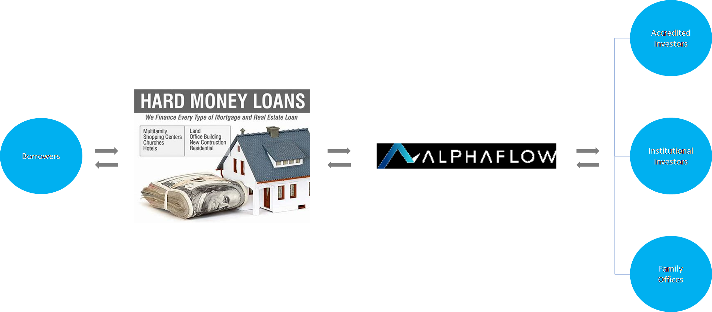
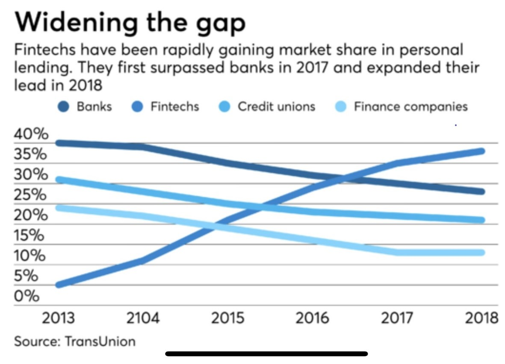
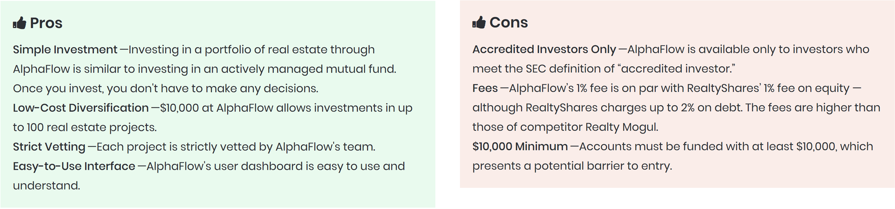

# <b>Case Study: Alphaflow<b>

## Overview

Alphaflow is a unique fintech company based in San Francisco. It was incorporated in 2015 by founder Ray Sturn. Alphaflow is a hybrid robo-advisory asset manager investing in short term real estate debt and has an interesting strategy to use technology, proprietary market data, professional investment managers and experience to match secure hard money lenders (“HML”) real estate debt opportunities with the capital markets space2. The current focus of the firm is to underwrite loans to alternative real estate lenders through their proprietary algorithms and database.

“A hard money loan is a type of loan that is secured by real property. Hard money loans are considered loans of "last resort" or short-term bridge loans. These loans are primarily used in real estate transactions, with the lender generally being individuals or companies and not banks1)”.

Ray, the founder of Alphaflow, grew up in a family that invested money with hard money lenders and is very familiar with the industry and its shortcomings. His industry experience led him to the pioneering solution which formed Alphaflow.

The Company has raised US$ 6.5 million from some of the most prolific investors in Silicon Valley (Social Capital, Y Combinator, and Upside Partnerships) as well as several well recognized Fintech investors including Point 72 and Clocktower Technology Ventures. According to crunchbase.com/organization/alphaflow, Alphaflow has raised US$ 6.4 million, below is a breakdown of the capital raising efforts:

The Company’s management team is made up of real estate, finance, and tech leaders including founders of RealtyShares, Fund That Flip and one of the first key employees at LendingHome.

## The Business

The company is tackling the $600 Billion dollar market of non-banked real estate lending initially through targeting the familiar US$50 billion HML market by becoming the provider of choice for small-to-medium sized loans (average loan size of $200,000).

“AlphaFlow Inc. (“AlphaFlow”) purchases first lien mortgage notes from top-tier originators around the nation, providing non-conventional liquidity to residential real estate lenders. AlphaFlow conducts extensive due diligence on each originator partner. Lender onboarding entails strict review of the firm’s management staff, historical loan performance, underwriting guidelines, quality control metrics, and onsite review by AlphaFlow of their lending operations4”.

The HML market is a very fragmented lending market that is currently limited by the backing of high net worth individuals. Alphaflow will enter the market through a B2B relationship with lenders versus going B2C directly to the borrowers, they developed a highly scalable and capital efficient model with a low customer acquisition cost and a high and recurring revenue per customer.

The first phase of penetrating the US$600 billion market is through Alphaflow’s existing core competitive edge in the US$50 billion HML market. Alphaflow intends to consolidate the fragmented HML’s industry through its pioneering approach and tech driven strategy. These consolidated opportunities would be met with a model that provides reach to the capital markets into this high yielding investment. Alphaflow currently makes its spread on these investments made, below is a diagram of the workflow.  

## Business Activities

Currently there is very limited, to no access, for institutional investors to this highly fragmented real estate debt market. The key lenders here are HMLs, which source money from local investors and underwrite and manage loans to contractors or real estate developers. These loans are for business purposes and can be issued in as fast as 3 – 5 days with a maturity between 6-12 months. However, HMLs have limited access to scalable capital and are funded by one or two high net worth individuals.

This is where Alphaflow comes in. Alphaflow is a pioneer in the real estate investment space with the creation of a software that assesses real estate lending taking into consideration over 50 factors. Alphaflow creates the bridge between the HMLs, that are too small, and large institutional investors and Family Offices, who do not have access to invest and given their minimum ticket size are restricted. Alphaflow is pooling capital markets access to the US$ 50 billion industry.

Alphaflow creates investment portfolios that include between 75-100 different loans diversified over multiple states. These investment portfolios target a yield ranging between 7.5% - 9.0% and are all short term in nature (less than 1 year). Ray Sturn recognized the opportunity to aggregate the HML market through the introduction of the capital markets to this traditionally under-funded HML market.

These individual investment opportunities form a part of the proprietary data set that Alphaflow has with regards to HMLs and their clients. This data gives Alphaflow an investment edge in this real estate debt market.

Institutional investors love the asset class and are happy to have access in this high yielding investment opportunity through a well-managed risk exposure. Typically the loans given by the HMLs is a first lien on a single family home or even a small apartment building. Alphaflow offers the HMLs:

1.  Loan processing instantly (versus days) through its software which replaces the banks CRM systems

2.  Underwriting capabilities which are supported by access to capital markets

3.  Ongoing tech support for their clients

The investment decision is based on key parameters. These investments yield between 8 – 12% depending on where you are in the country2. The term of the loan is typically 12 months, but usually is closed within 8.5 months. The investment lifecycle is illustrated below:

Source: https://www.alphaflow.com/how-it-works/
 
 
The institutional investors base is estimated to be in the trillions of dollars of assets under management. Alphaflow are now around 9 months in with an investment given by a leading US institutional investor of US$ 500 million and in the process of adding an additional institutional investor with a sizeable investment. Alphaflow invests this capital among other capital available to the Company and makes a spread on the capital it gets from its institutional investors.
 
*What solution does this company offer that their competitors do not or cannot offer? (What is the unfair advantage they utilize?)*
 
This rapid success is based on the differentiation that Alphaflow has created utilizing the decades of data they have from the HMLs’ database. Alphaflow installs their software for their HMLs to use instead of their current loan management system, hence creating an ecosystem that relies on Alphaflows presence in the lending process.
 
In addition to the above, Alphaflow has a professional investment team that filters through the investment opportunities for its clients and automatically invests. This also can automatically reinvest the capital gains that are made in your account. As opposed to other competitors that only show the opportunities and leave the client to filter through all the opportunities and select their investment10.  
 
*Which technologies are they currently using, and how are they implementing them? (This may take a little bit of sleuthing–– you may want to search the company’s engineering blog or use sites like Stackshare to find this information.)*
 
Alphaflow utilizes the following tech stack to enable its offering:

Source7: https://stackshare.io/alphaflow/alphaflow
 
I imagine that they will also be using SQL as well to be able to manage the database of information they are hosting as well as Cloud technology.
 
## Landscape:
 
 
*What have been the major trends and innovations of this domain over the last 5-10 years?*
 
Over the last five to ten years the industry has started to replace the utilization of traditional sources.

The market is now expecting speed and simplicity in the services they receive and the impact of AI and ML have greatly enhanced the edge of Fintech companies. As we can see from the graph above Fintech solutions have taken up almost 40% of the market up from less then 5% in 20134.
 
“Robo-advisory is basically an automated, algorithm based portfolio management service offered by wealth management companies. It significantly decreases management cost involved in providing all the financial advice through manpower, thus assisting wealth management companies to provide this as a minimal cost service for their customers. Robo advisory is an automated portfolio management software, which allows the customers to consistently adjust and customize the online investment in order to meet their long-term financial goals and short-term investment strategy.
 
Rise in internet penetration, advice related to investment at low cost, increase in maturity of digital advice technologies are anticipated to expand the growth of the robo-advisory market during the period from 2017 to 2023. The convenient option of automated process without any manual engagement of financial advisors is expected to strengthen the market growth till 20236”.    
 
Key players across the value chain include Betterment, FutureAdvisor, Personal Capital, Vanguard Personal Advisor, Wealthfront, WiseBanyan, SigFid Wealth Management, and others6.

In the words of Ray Strun (Alphaflow CEO) "At AlphaFlow we focus on fixed income so I’ll answer with regards to the credit markets. In the increasingly difficult search for yield, alternative fixed income opportunities are quickly garnering attention from traditional asset managers. The culprit is a disconnect in risk and reward in much of the credit world, perhaps illustrated best with Argentina’s recent issuance of a century bond shortly after exiting default. When the returns simply stop matching the risk for too long, savvy investors look for new opportunities. For us, that means we’re hearing from more hedge funds, family offices, and international investment groups looking to expand their investment relationships in order to tap into new sources of yield. We don’t expect rates to meaningfully increase anytime soon, so we think you’ll see more managers including alternative lenders in their strategies than ever before5". 
 
## Results
 
Despite being in the early stages of its development, the company has signed up globally renowned institutional investors and is targeting the 2,000 to 3,000 HMLs in the US market.

The company is still at its early stages of growth and has already sourced over US$ 1 billion of liquidity from institutional investors allowing it to quickly reach many HMLs, hence expanding its market position rapidly.
 
Alphaflow has extended to date approximately 1,000 loans with three quarters being paid off. The Company has diversified this loan portfolio in over 40 states around the US with a weighted LTV of approximately 65% and a net weighted yield of just over 8%. The success in Alphaflows investment approach is evident in the very low principal loss ratio of just 0.17% versus an industry average of approximately 2%11.
 
Alphaflow has invested this capital with HMLs across 42 states in the US market. Hence offering a new investment product to the capital markets that was previously unavailable.      
 
 
*How is your company performing relative to competitors in the same domain?*

Alphaflow competes with Fundrise, RealtyShares and RealtyMogul8. That said Alphaflow has the unique dataset competition in the sense it is a pioneer in its space and is the first to offer access to this type of investment real estate product. Generally there are a number of companies that offer real estate investment/debt opportunities in the traditional space. However, Alphaflow is the only one that has successfully created a hybrid model incorporated human and machine intelligence.
  

Source8: https://investorjunkie.com/reviews/alphaflow/
 
 
## Recommendations
 
*If you were to advise the company, what products or services would you suggest they offer? (This could be something that a competitor offers, or use your imagination!)*
 
In reviewing Alphaflow, with all the early success in the US$ 50 billion HML market, I believe targeting the larger US$600 billion will not be as easy. Alphaflow currently has a strong advantage with the dataset they are currently hosting.
 
Alphaflow currently has an average LTV of 65% which is in line with the current industry norms. In 2009 to 2012 the industry norm was at 90%+, naturally this tapered off after the financial crisis in 20089. There is room to expand the LTV ratio given the Company’s current database, risk assessment parameters and software. 
  
In addition Alphaflow’s minimal investment period, shortening this period could act as a strong treasury management tool for corporates, institutional investors, etc.
 
*Why do you think that offering this product or service would benefit the company?*
 
In the past the industry did not have the advancement we have today in AI and ML. Alphaflow’s average loan size is US$ 200,000 and every incremental percentage point in their LTV will add an additional US$ 3,000. This will increase the target market size that Alphaflow is currently targeting and in turn their revenue pool, with minimal cost to the current algorithm.

This will allow the company to also offer a more attractive product to its clients and in turn grab a larger share of the pie from competition.

Naturally this would need to be studied in depth to make sure the risk assessment process has been adjusted for a higher LTV ratio.
 
*What technologies would this additional product or service utilize?*
 
It would potentially only require a readjustment in the algorithm in Python. Additionally new sets of data may be needed for additional risk assessments which may need that addition of further queries of their clients in the API. This can be done in Python. 

This new information would need to be added to the existing database in the cloud server. This will be managed through the addition of a dataset to the SQL Server. 
 
*Why are these technologies appropriate for your solution?*

They are the current technology being used by the company and hence would be a cost and time efficient solution. Additionally some of the benefits of programming in Python11 over other programming languages include:
1. Presence of Third Party Modules
2. Extensive Support Libraries
3. Open Source and Community Development
4. Learning Ease and Support Available
5. User-friendly Data Structures
6. Productivity and Speed

As can be seen from the above-mentioned points, Python offers a number of advantages for software development10.

Source:

1. https://www.investopedia.com/terms/h/hard_money_loan.asp
2. https://www.alphaflow.com/about-us/
3. Transunion
4. https://www.alphaflow.com/partners/
5. https://www.alphaflow.com/resources/news/alternative-investment-managers-ray-sturm/
6. https://www.alliedmarketresearch.com/robo-advisory-market
7. https://stackshare.io/alphaflow/alphaflow
8. https://investorjunkie.com/reviews/alphaflow/
9. https://www.magnifymoney.com/blog/mortgage/u-s-mortgage-market-statistics-2018/
10. https://www.invensis.net/blog/it/benefits-of-python-over-other-programming-languages/   
11. https://www.alphaflow.com/performance/
